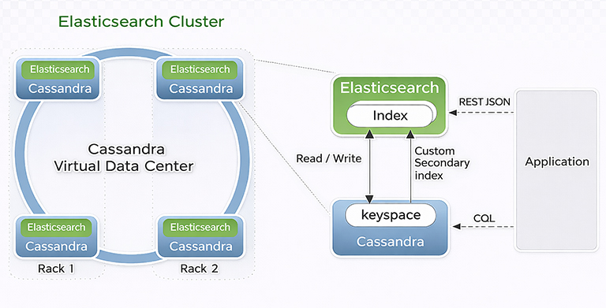

Architecture
============

Elassandra embeds OpenSearch inside Apache Cassandra so that each node participates in
both the storage ring and the search cluster.

Concepts Mapping
----------------

.. cssclass:: table-bordered

    +------------------------+--------------------+------------------------------------------------------------------+
    | OpenSearch             | Cassandra          | Description                                                      |
    +========================+====================+==================================================================+
    | Cluster                | Datacenter group   | Nodes in the same datacenter group share search metadata.        |
    +------------------------+--------------------+------------------------------------------------------------------+
    | Shard                  | Local token ranges | Each node serves search for the data it stores locally.          |
    +------------------------+--------------------+------------------------------------------------------------------+
    | Index                  | Keyspace           | An index is backed by a Cassandra keyspace.                      |
    +------------------------+--------------------+------------------------------------------------------------------+
    | ``_doc``               | Table              | The current line uses the single ``_doc`` document model.        |
    +------------------------+--------------------+------------------------------------------------------------------+
    | Document               | Row                | Search documents are stored as Cassandra rows.                   |
    +------------------------+--------------------+------------------------------------------------------------------+
    | Field                  | Column or cell     | Indexed fields are backed by Cassandra columns.                  |
    +------------------------+--------------------+------------------------------------------------------------------+
    | Nested/object field    | UDT or map         | Structured fields are mapped onto Cassandra composite types.     |
    +------------------------+--------------------+------------------------------------------------------------------+

From the OpenSearch point of view, Elassandra behaves like a distributed search engine.
From the Cassandra point of view, Elassandra adds a secondary-index-backed search layer
without moving source-of-truth data out of Cassandra tables.

Durability
----------

Cassandra remains the durable storage layer:

* writes are recorded in commit logs and memtables
* flushes materialize SSTables and the corresponding search structures
* restart and recovery replay Cassandra state and rebuild the local search view when needed

Because Cassandra owns replication and durability, Elassandra does not depend on a
separate search translog for cluster-wide correctness.

Shards and Replicas
-------------------

Elassandra does not use fixed shard counts in the same way as a standalone search cluster.
Instead:

* data placement follows Cassandra token ownership
* replica behavior follows Cassandra keyspace replication
* adding a node redistributes token ranges instead of resharding a separate data store

This lets Elassandra scale horizontally with Cassandra while keeping search local to the
data already stored on each node.

Write path
----------

When a document is written through the OpenSearch HTTP API or through CQL:

#. Elassandra translates the write into Cassandra mutations.
#. Cassandra stores the row using its normal write path.
#. The Elassandra secondary index updates the local search structures.
#. Cluster metadata updates are coordinated through Cassandra-backed metadata tables.

For search-first use cases, creating an index can also create the backing Cassandra
schema automatically. For Cassandra-first use cases, Elassandra can discover an existing
table schema and expose it as an OpenSearch mapping.

Search path
-----------

When a search request arrives:

#. The coordinator resolves the target indices and token ranges from Cassandra-backed metadata.
#. Requests are routed to nodes that own the relevant token ranges.
#. Each node executes the local OpenSearch query against its local search view.
#. Matching hits are resolved against Cassandra rows when field retrieval is needed.
#. The coordinator merges shard responses and returns a standard OpenSearch-style response.

This model keeps search close to the data and avoids a separate search-only storage tier.

Mapping and CQL schema management
---------------------------------

Elassandra supports two complementary workflows:

* **OpenSearch-first**: define an index or mapping and let Elassandra create the backing
  Cassandra keyspace, table, and secondary index objects.
* **Cassandra-first**: create the keyspace and table yourself, then use mapping discovery
  so Elassandra exposes that schema through OpenSearch.

Schema and metadata changes are stored in Cassandra and propagated through the cluster,
which keeps storage and search definitions aligned.
